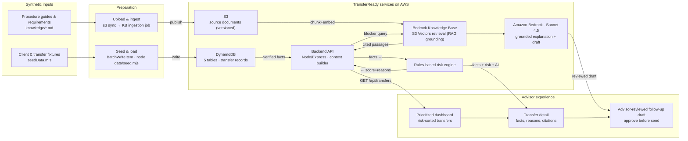

# NorthStar

An AI-assisted account transfer processing platform. This monorepo contains the frontend, backend, AI prompt/schema assets, synthetic data, domain knowledge, and infrastructure needed to run and demo the system.

## Repository Structure

```
lpl-financial/
├── frontend/          # React + TypeScript + Vite UI
├── backend/           # Node + TypeScript API
│   └── src/
│       ├── routes/        # HTTP route handlers
│       ├── services/      # Business logic
│       ├── repositories/  # Data access layer
│       ├── aws/           # AWS SDK clients (Bedrock, DynamoDB, S3)
│       ├── prompts/       # LLM prompt templates
│       ├── schemas/       # Request/response + LLM output schemas
│       └── types/         # Shared TypeScript types
├── data/              # Synthetic data + seed scripts
├── knowledge/         # Domain procedures, requirements, escalation rules
├── infrastructure/    # EC2 / IAM / deploy scripts
├── docs/              # Architecture, API, data model, demo guides
├── scripts/           # setup / seed / demo helper scripts
├── README.md
├── .gitignore
└── .env.example
```

## Architecture

**Synthetic data + firm procedures → AWS services → advisor dashboard & reviewed draft**

The system flows left-to-right through four stages: synthetic inputs are prepared and loaded into AWS; backend services combine verified facts with RAG-grounded retrieval to produce risk-scored transfers; and the advisor works from a prioritized dashboard down to a reviewed follow-up draft.



### Flow stages

1. **Synthetic inputs** — Client/transfer fixtures (`data/seedData.mjs`) and firm procedure guides (`knowledge/*.md`).
2. **Preparation** — Fixtures are seeded into DynamoDB (`node data/seed.mjs`, `BatchWriteItem`); procedure docs are uploaded to S3 and ingested into the Bedrock Knowledge Base.
3. **TransferReady services on AWS** — The Node/Express backend reads verified facts from DynamoDB, computes risk via the rules-based engine, retrieves cited passages from the Knowledge Base (RAG), and uses Amazon Bedrock (Sonnet) for a grounded explanation and follow-up draft.
4. **Advisor experience** — A risk-sorted **prioritized dashboard** → **transfer detail** (facts, reasons, citations) → an **advisor-reviewed follow-up draft** that requires approval before sending.

## Quick Start

```bash
# 1. Install dependencies (root + workspaces)
npm install

# 2. Copy and fill environment variables
cp .env.example .env

# 3. Seed synthetic data
./scripts/seed.sh

# 4. Run the dev stack (frontend + backend)
npm run dev
```

## Prerequisites

- Node.js >= 20
- npm >= 10
- AWS credentials configured (for Bedrock / DynamoDB access)

## Documentation

See the [`docs/`](./docs) directory for architecture, API reference, data model, and demo walkthroughs.
